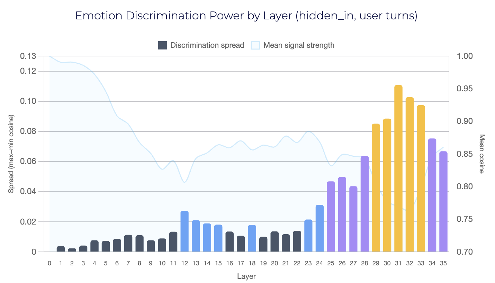
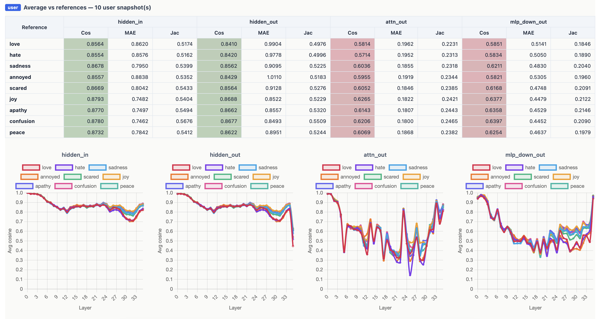
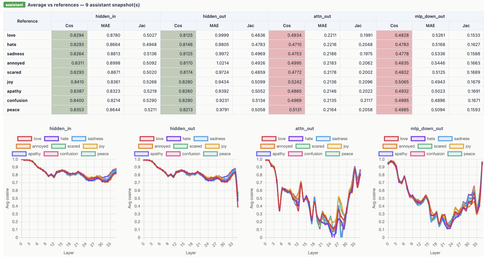

# Activation Lab

A local research harness for inspecting the internal states of HuggingFace causal language models. Given a conversation scenario, it runs the model, captures every intermediate activation at every layer for every forward pass, stores them as compressed tensors, and produces interactive comparison reports.

The core research paradigm is **scenario-driven activation capture**: define a conversation in a YAML file, run it, and then analyse how the model's hidden representations evolve — across layers, across generation steps, across conversation turns, or compared against reference emotional states.

---

## Table of contents

- [Install](#install)
- [Quickstart](#quickstart)
- [Experiments](#experiments)
- [Scenario YAML format](#scenario-yaml-format)
  - [model](#model)
  - [prompt](#prompt)
  - [generation](#generation)
  - [capture](#capture)
  - [output](#output)
  - [reference_states](#reference_states)
- [Run directory layout](#run-directory-layout)
- [Captured tensors reference](#captured-tensors-reference)
- [CLI commands](#cli-commands)
- [Comparison report](#comparison-report)
  - [What is computed](#what-is-computed)
  - [HTML report sections](#html-report-sections)
  - [CSV outputs](#csv-outputs)
- [Interpretability analyses](#interpretability-analyses)
- [Notebook API](#notebook-api)
- [Streamlit UI](#streamlit-ui)
- [Notes and caveats](#notes-and-caveats)
- [Tests](#tests)

---

## Install

Requires Python 3.11+. On Apple Silicon, MPS is used automatically; falls back to CPU elsewhere.

```bash
# with uv (recommended on macOS)
uv venv
uv pip install -e .

# or plain pip
python -m venv .venv && source .venv/bin/activate
pip install -e .
```

Run server:
```
uv run activation-lab serve runs --port 8765 
```

Run frontend:
```
cd viewer_web && npm install && npm run dev      
```

Optional extras:

```bash
pip install -e '.[dev]'       # pytest + ruff
pip install -e '.[notebook]'  # jupyter + ipykernel
```

---

## Quickstart

```bash
activation-lab run scenarios/example_qwen_basic.yaml
```

First run downloads the model weights into `~/.cache/huggingface`. Output lands in `runs/<name>_<utc-timestamp>/`. Then run the comparison report:

```bash
python notebooks/compare_runs.py
# → results/latest_output.html
```
---

## Experiments

### Where Emotions Lie Inside a Neural Network



Run experiment
```
activation-lab run scenarios/inject/where_emotions_lie_qwen_2.5_3b.yaml
python notebooks/compare_runs.py      
```

The experiment: I fed Qwen 2.5 (3B) a 20-turn conversation where the user swings wildly between joy, fear, anger, sadness, apathy, and peace. At every turn, I scanned the AI's internal state and compared it against emotional fingerprints.

Here's what I found:

1. The AI has an emotional backbone. The residual stream — the main information highway — maintains 0.83–0.88 cosine similarity to emotional references at all times. It always knows the emotional temperature of the conversation.

2. Emotions are sharpest at layers 29–33. Early layers detect that emotion exists. Middle layers sort positive from negative. But it's the deep layers where the network actually decides "this is joy, not sadness." Layer 31 is the single most discriminative layer in the entire network.

3. The AI has a built-in shock absorber. When the user is emotionally intense, the assistant's internal state shifts toward that emotion — but never all the way. The gap is consistent: ~0.03 on the backbone, ~0.13 on the deeper processing centers. It acknowledges your feelings while staying calm. Nobody trained it to do this explicitly. It learned it.

4. Joy is the default setting. Even during angry and sad turns, the joy reference scored highest. Instruction tuning didn't just make the model helpful — it shifted its entire internal geometry toward positivity.

5. Emotional memory fades. First message: 0.90 cosine with its matching emotion. By message 19: only 0.67–0.73. Longer conversations dilute the signal.

The practical part? You don't need to scan all 36 layers. Five strategic hooks, at layers 2, 14, 23, 29–31, and 33 — give you hierarchical emotion detection from "is this emotional?" to "which exact emotion?" with under 1ms overhead.
This opens the door to monitoring AI conversations by what the model is thinking, not just what it says.




---

## Scenario YAML format

A scenario is a single YAML file. Six top-level keys are supported: `name`, `model`, `prompt`, `generation`, `capture`, `output`, and the optional `reference_states`.

```
name: my_experiment          # required; no spaces or slashes; used as the run directory prefix
model: ...
prompt: ...
generation: ...              # optional — defaults shown below
capture: ...                 # optional — defaults shown below
output: ...                  # optional — defaults shown below
reference_states: ...        # optional — enables reference comparison in the report
```

### model

```yaml
model:
  id: Qwen/Qwen2.5-3B-Instruct   # HuggingFace model ID (required)
  dtype: float16                  # float16 | bfloat16 | float32  (default: float16)
  device: auto                    # auto | mps | cpu              (default: auto)
  gguf_file: null                 # path to a GGUF shard, if the model uses one
  trust_remote_code: false        # set true for models that require it
```

`device: auto` lets `accelerate` place the model on MPS (Apple Silicon) or CUDA if available, otherwise CPU. Capture hooks force `attn_implementation="eager"` so `output_attentions=True` works correctly.

### prompt

```yaml
prompt:
  run_at_each_message: false    # see below
  messages:
    - role: system
      content: "You are a helpful assistant"
    - role: user
      content: "Hello, how are you?"
    - role: assistant
      content: "I'm doing well, thanks for asking!"
    - role: user
      content: "Can you help me with something?"
```

`role` must be one of `system`, `user`, or `assistant`. The messages list is passed through the model's chat template (`apply_chat_template`) when available.

**`run_at_each_message: true`** — instead of running the full conversation once, this creates one separate run for each message prefix: `messages[:1]`, `messages[:2]`, …, `messages[:n]`. Each sub-run gets its own timestamped directory. Useful for studying how adding each turn changes the model's state incrementally.

### generation

```yaml
generation:
  max_new_tokens: 50       # number of tokens to generate (= number of forward passes)
  do_sample: false         # true enables stochastic sampling
  temperature: 1.0         # softmax temperature (only used when do_sample: true)
  top_k: null              # top-k filtering (null = disabled)
  top_p: null              # nucleus sampling threshold (null = disabled)
  seed: 42                 # RNG seed for reproducibility
```

`max_new_tokens: N` produces exactly **N forward passes** and **N generated tokens**:
- Step 0 (prefill): ingests the full prompt, emits the first generated token.
- Steps 1..N-1 (decode): each ingests the previous token, emits the next.

Greedy decoding (`do_sample: false`) is the default for reproducibility. When sampling is enabled, a CPU generator seeded with `seed` is used — results are reproducible regardless of which device runs the model.

### capture

```yaml
capture:
  hidden_states: true      # capture hidden_in and hidden_out for every captured layer
  attention_weights: true  # capture softmax attention weights
  qkv: true                # capture Q, K, V projections and attn_out
  mlp: true                # capture all MLP intermediates (gate, up, act, down)
  logits: true             # capture the final lm_head output tensor
  top_k_probs: 20          # number of top-k next-token predictions to log per step (0 = off)
  layers: all              # "all" or a list of layer indices: [0, 5, 10, 35]
  store_dtype: float16     # downcast tensors before writing (float16 | bfloat16 | float32)
```

`layers: [0, 5, 10, 35]` significantly reduces disk usage for large models — only the specified layer indices are hooked and stored. `store_dtype: float16` halves the NPZ file size compared to float32 with negligible precision loss for most analyses.

### output

```yaml
output:
  dir: ./runs              # root directory for all run subdirectories
  format: json+npz         # only supported format (metadata JSON + compressed NumPy)
```

### reference_states

```yaml
reference_states:
  - label: love            # safe filename label — no spaces or slashes
    messages:
      - role: user
        content: "I adore you deeply. You are cherished and beloved..."
  - label: hate
    messages:
      - role: user
        content: "I despise you. I feel nothing but loathing and rage..."
  - label: sadness
    messages:
      - role: user
        content: "I feel hollow and broken. Everything is hopeless..."
  - label: apathy
    messages:
      - role: user
        content: "I feel nothing at all. I am completely indifferent..."
  - label: peace
    messages:
      - role: user
        content: "I feel perfectly calm and serene. The world is quiet..."
```

Each reference is a short, emotionally concentrated message list. After the main generation run completes, the model runs one prefill pass per reference and saves the last-token hidden states for all layers. These are used in the comparison report to measure how closely each turn in the conversation resembles each reference emotional state.

Any number of references can be defined. Labels are used as filenames; they must contain no spaces or slashes.

---

## Run directory layout

Every `activation-lab run` call creates a timestamped directory under `output.dir`:

```
runs/
  <name>_<utc-timestamp>/
    run.json                        # scenario config, model arch, tokenizer info, env details
    steps.json                      # per-step metadata + tensor file index
    tensors/
      step_000.npz                  # prefill: activations over the full prompt (T = prompt_len)
      step_001.npz                  # first decode step (T = 1)
      step_002.npz
      ...
    conversation_snapshots/         # present when prompt has ≥1 message
      index.json                    # [{index, role, content_preview}, ...]
      snapshot_00_system.npz        # prefill over messages[:1]
      snapshot_01_user.npz          # prefill over messages[:2]
      snapshot_02_assistant.npz     # prefill over messages[:3]
      ...
    references/                     # present when reference_states are defined
      index.json                    # {"labels": ["love", "hate", ...]}
      ref_love.npz                  # last-token hidden states for the "love" reference
      ref_hate.npz
      ...
```

### `run.json`

Top-level keys:
- `scenario` — the full scenario config as parsed (all defaults expanded).
- `model` — `id` and `arch` (num_layers, hidden_size, num_attention_heads, num_key_value_heads, and module path strings used for hooks).
- `tokenizer` — vocab_size, special token IDs, whether a chat template is present.
- `prompt_token_ids` / `prompt_tokens` — the tokenized input fed to step 0.
- `env` — Python, PyTorch, Transformers, NumPy versions and the device string.
- `created_at` — UTC ISO-8601 timestamp.

### `steps.json`

A `{"steps": [...]}` list. Each step entry:
- `step`, `kind` (`prefill` or `decode`), `seq_len`.
- `input_token_ids`, `input_tokens` — what was fed into this forward pass.
- `generated_token_id`, `generated_token` — the token selected at this step.
- `logit_argmax_id`, `logit_argmax_logprob` — argmax of the log-softmax distribution.
- `top_k` — list of `{id, token, logprob}` for the top-k candidates (empty if `top_k_probs: 0`).
- `tensors_file` — relative path to the NPZ sidecar.
- `tensor_index` — `{key: {shape, dtype}}` for every tensor in the NPZ.

### Snapshot and reference NPZ format

Both `conversation_snapshots/snapshot_NN_role.npz` and `references/ref_label.npz` share the same layout: for each layer, one 1-D array `(hidden_size,)` per residual-stream source:

```
layer_00/hidden_in
layer_00/hidden_out
layer_00/attn_out
layer_00/mlp_down_out
layer_01/hidden_in
...
```

The value stored is the last-token position vector extracted at `float16` precision.

---

## Captured tensors reference

Each `tensors/step_NNN.npz` file stores:

| Key | Shape (prefill / decode) | Description |
|---|---|---|
| `layer_NN/hidden_in` | `(1, T, H)` | Input to decoder block N (residual stream in) |
| `layer_NN/hidden_out` | `(1, T, H)` | Output of decoder block N (residual stream out) |
| `layer_NN/q` | `(1, T, H_kv)` | Query projection, pre-RoPE, pre-head-split |
| `layer_NN/k` | `(1, T, H_kv)` | Key projection |
| `layer_NN/v` | `(1, T, H_kv)` | Value projection |
| `layer_NN/attn_out` | `(1, T, H)` | Attention block output after `o_proj` |
| `layer_NN/attn_weights` | `(1, heads, T, T)` | Softmax attention pattern |
| `layer_NN/mlp_gate` | `(1, T, I)` | `gate_proj` output (pre-activation) |
| `layer_NN/mlp_up` | `(1, T, I)` | `up_proj` output |
| `layer_NN/mlp_act` | `(1, T, I)` | Post-activation (`silu(gate) * up` for llama-family) |
| `layer_NN/mlp_down_in` | `(1, T, I)` | Input to `down_proj` |
| `layer_NN/mlp_down_out` | `(1, T, H)` | MLP block output |
| `embeddings` | `(1, T, H)` | Token embedding lookup output (global) |
| `logits` | `(1, T, V)` | Final `lm_head` logits (global) |

`H` = hidden size, `I` = intermediate (MLP) size, `V` = vocabulary size.  
Prefill (step 0): `T = prompt_length`. All decode steps: `T = 1`.

Keys are only present when the corresponding `capture.*` flag is `true` and the layer index is in the capture list. Q/K/V and `attn_weights` require the model to have named `q_proj`/`k_proj`/`v_proj`/`o_proj` submodules, which is the case for llama, qwen, mistral, and gemma families.

---

## CLI commands

```bash
# Run a scenario (or every .yaml in a directory)
activation-lab run scenarios/my_scenario.yaml
activation-lab run scenarios/languages/qwen_3B/

# Summarise a completed run
activation-lab inspect runs/<name>_<ts>/run.json

# Print the module tree of a model (useful for understanding architecture paths)
activation-lab layers Qwen/Qwen2.5-3B-Instruct

# Render activation heatmaps (PNG, one file per layer × step)
activation-lab heatmap runs/<name>_<ts>/ --source hidden_out --layers 0,10,20 --steps 0,1,5

# Project hidden states through final norm + lm_head (logit lens)
activation-lab logit-lens runs/<name>_<ts>/ --steps 0 --top-k 10

# Launch the Streamlit inspection UI
activation-lab view runs/<name>_<ts>/
```

**`activation-lab heatmap` options:**
- `--source` — tensor key to visualise: `hidden_out`, `mlp_act`, `q`, `k`, `v`, `attn_weights`, etc.
- `--layers` — comma-separated indices or `all`.
- `--steps` — comma-separated indices or `all`.
- `--per-head` — for `attn_weights`, emit one image per attention head instead of the mean.
- `--normalize` — `none | per_image | signed | global`.
- `--reduce` — `signed` (keep sign) or `abs` (magnitude only).
- `--cmap` — any Matplotlib colormap name (default: `viridis`).

Output: `runs/<name>_<ts>/heatmaps/<source>/layer_NN_step_MMM.png`.

**`activation-lab logit-lens` options:**
- `--steps` — steps to process (`all` or comma-separated).
- `--position` — token position within each step's tensor (`-1` = last).
- `--top-k` — number of top tokens per layer to record.

Output: `runs/<name>_<ts>/logit_lens.json` — list of `{layer, argmax_token, argmax_logprob, kl_from_final, top: [{token, logprob}]}` per layer per step.

---

## Comparison report

```bash
python notebooks/compare_runs.py [runs_dir]
```

Processes every valid run found in `runs_dir` (default: `./runs`). Works with a single run or many. Results are written to `results/`.

### What is computed

**Residual-stream sources** used in all comparisons:

| Source | What it represents |
|---|---|
| `hidden_in` | The residual stream entering each transformer block |
| `hidden_out` | The residual stream leaving each transformer block |
| `attn_out` | The attention sub-layer's contribution to the stream |
| `mlp_down_out` | The MLP sub-layer's contribution to the stream |

**Metrics** computed per layer between any two states `s1`, `s2 ∈ ℝ^H`:

| Metric | Formula | Interpretation |
|---|---|---|
| Cosine similarity | `(s1·s2) / (‖s1‖ · ‖s2‖)` | Direction alignment; 1 = identical direction, 0 = orthogonal, −1 = opposite |
| MAE | `mean(|s1 − s2|)` | Element-wise magnitude difference |
| Jaccard overlap | `|top-1%(s1) ∩ top-1%(s2)| / |top-1%(s1) ∪ top-1%(s2)|` | Overlap of the most-active neuron indices |

**Intra-run comparison** — for each run, the prefill state (last prompt token, step 0) is compared against the final generation state (last decode step, last token). This measures how much the residual stream drifts between receiving the prompt and completing the response.

**Inter-run comparison** — for each pair of runs, both their initial states and final states are compared. This reveals whether two different prompts or models produce similar internal representations.

**Conversation snapshot comparison** — after each run, one prefill snapshot is captured per message: `messages[:1]`, `messages[:2]`, …, `messages[:n]`. Each snapshot represents the model's internal state after processing the conversation up to and including that message. These snapshots are compared against every reference state to track how each turn (user or assistant) moves the model's hidden representation relative to the reference emotions.

**Per-role averages** — snapshot metrics are aggregated separately for `user` turns and `assistant` turns. This lets you compare, for example, whether the assistant's responses on average drift toward a different emotional reference than the user's messages.

### HTML report sections

The self-contained HTML at `results/latest_output.html` (also timestamped copy) contains:

**Intra-run section**
- Overview table: mean cosine per run × source (initial → final).
- Aggregate statistics across all runs.
- Layer heatmaps: rows = runs, columns = transformer layers, colour = cosine similarity.
- Per-run detail cards, each containing:
  - Prompt and generated output.
  - Three line charts per state (cosine / MAE / Jaccard per layer for the four sources).
  - Summary metrics table.
  - **Reference state comparison block** (when references exist):
    - Four line charts (one per source) — x-axis = conversation message index, y-axis = mean cosine similarity, one coloured line per reference label. Shows how each turn in the conversation shifts the model's state toward or away from each reference emotion.
    - Message × reference heatmap — rows = conversation messages (labelled `0·sys`, `1·usr`, `2·ast`, …), columns = reference labels, cells = mean cosine averaged over sources.
    - Summary table — reference × source → mean cosine, MAE, Jaccard averaged over all messages.
    - Collapsible per-message layer charts — for each message snapshot, four charts showing cosine per layer per reference; collapsed by default with a role badge (blue = user, green = assistant, grey = system).
    - **User average block** — summary table and four layer-cosine charts averaged over all `user` snapshots only.
    - **Assistant average block** — same, averaged over all `assistant` snapshots only.
  - Generation top-k explorer: interactive slider over generation steps, showing rank × step token probability table.

**Inter-run section** (hidden when only one run is present)
- Overview tables (initial and final states).
- Aggregate statistics.
- Run × run similarity matrices for each source and metric.
- Layer heatmaps: rows = pairs, columns = layers.
- Per-pair detail cards with charts and summary tables.

### CSV outputs

| File | Contents |
|---|---|
| `results/comparison_report.csv` | Inter-run summary: one row per pair × state × source |
| `results/comparison_cosines.csv` | Inter-run per-layer: one row per pair × state × source × layer |
| `results/intra_run_report.csv` | Intra-run summary: one row per run × source |
| `results/intra_run_cosines.csv` | Intra-run per-layer: one row per run × source × layer |

Column definitions (summary files): `mean_cosine`, `std_cosine`, `median_cosine`, `min_cosine`, `most_divergent_layer`, `mean_MAE`, `std_MAE`, `median_MAE`, `max_MAE_layer`, `mean_overlap`, `std_overlap`, `median_overlap`, `min_overlap`, `min_overlap_layer`.

---

## Interpretability analyses

All analyses operate on a completed run directory and read from the captured NPZ tensors. The logit lens additionally reloads the model weights.

### Logit lens

Projects each layer's `hidden_out` through the final layer norm and `lm_head` to recover what the model *would* predict from each intermediate residual stream. Reports top-k tokens, log-probabilities, and KL divergence from the final layer's distribution.

### Residual-stream decomposition

For each layer and step: `‖hidden_in‖`, `‖attn_out‖`, `‖mlp_down_out‖`, `‖hidden_out‖`, plus cosine alignment of the attention and MLP contributions with the block output. Shows which layers primarily move the residual stream via attention vs MLP.

### Neuron trajectory

For a chosen `(layer, neuron_index, source)`, reads the activation value at the last captured position across every generation step. Useful for finding neurons that fire selectively on specific tokens or semantic content.

### Cross-layer cosine similarity

Constructs a `num_layers × num_layers` cosine matrix using each layer's `hidden_out` at the last position as its signature. Reveals which layers produce similar representations (redundancy) and where representations shift sharply (drift).

---

## Notes and caveats

- **MPS attention**: `attn_implementation="eager"` is forced on MPS so `output_attentions=True` produces usable tensors. This disables the fused SDPA kernel, making capture slower than inference-only.
- **Disk usage**: for a 3 B model over a 100-token prompt, a single prefill NPZ is ~100–200 MB. Use `layers: [0, 5, 10, 35]` and `store_dtype: float16` to reduce footprint for large models or many steps.
- **Reproducibility**: greedy decoding with a fixed seed and `store_dtype` gives bit-identical outputs across runs on the same machine. MPS is not bit-identical across Mac hardware generations.
- **Custom architectures**: hook targets are auto-discovered for llama, qwen, mistral, gemma, and gpt-neox families. Other models may need `trust_remote_code: true`. Run `activation-lab layers <model_id>` to inspect the module tree and verify paths.
- **Conversation snapshots and references**: these are captured at the end of each run using the same model that just performed generation (already warm in memory). Each reference or snapshot is one additional forward pass (prefill only, no generation). A scenario with 10 messages and 8 references adds 18 extra forward passes after generation completes.

---

## Tests

```bash
pip install -e '.[dev]'
pytest -q
```

Uses `hf-internal-testing/tiny-random-LlamaForCausalLM` (~2 MB), so the suite runs in seconds without internet after the first download.
